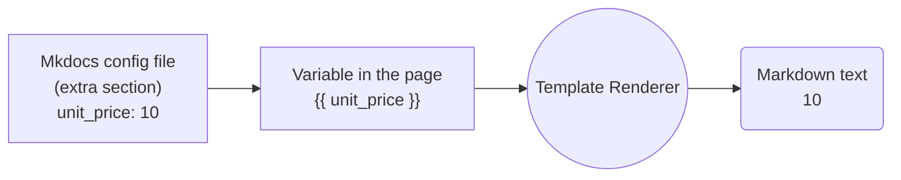
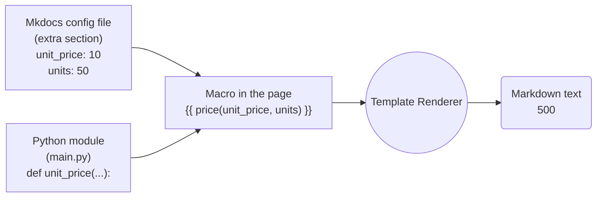
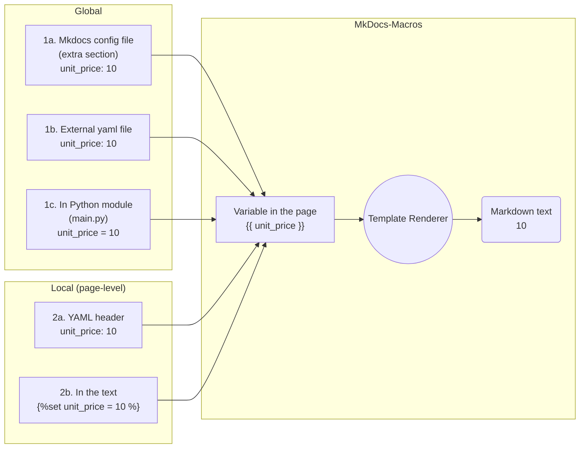

Mkdocs-Macros
=============
**A plugin/mini-framework for unleashing the power of [Mkdocs](https://www.mkdocs.org/)
static website generator, with the use of variables and macros.**

!!! Tip "A mini-framework"
    Mkdocs-Macros is more than a "plugin". It is a **mini-framework**
    developed with one goal in mind: 
    
    **To enhance mkdocs with the macro and automation capabilities
    available to a [wiki engine](https://wiki.c2.com/?WikiEngine).** [^6]

    For more information, see [Why this project?](why.md)
    

[^6]: With reference to existing wiki engines such as [Dokuwiki](https://www.dokuwiki.org/dokuwiki) or [Atlassian Confluence](https://www.atlassian.com/software/confluence).

## Getting started

### Definition

**Mkdocs-Macros** is a plugin/mini-framework that
makes it easy for contributors
of an [MkDocs](https://www.mkdocs.org/) website to produce richer and more 
beautiful Markdown pages (with the `.md` extension). It can do two things:

1. Transforming the markdown pages
into [Jinja2](https://jinja.palletsprojects.com/en/2.11.x/) templates
that:  
     - Use environment or custom **variables**, 
     - Call pre-defined or custom **macros** (functions, generally defined in a Python module), 
     - Exploit standard or custom **[filters](https://jinja.palletsprojects.com/en/3.1.x/templates/#filters)**
1. **Replacing MkDocs plugins** for a wide range of tasks: e.g. manipulating the navigation, adding files after the html pages have already been generated etc.

The capabilities of **mkdocs-macros-plugin** are so wide 
that it can be called a **"mini-framework"**.

**Mkdocs-Macros** is very easy to use **out of the box**,
even for small documentation projects: it provides
data about the platform, the git repository (if any), etc. 

!!! Warning "Mkdocs-Macros is not for HTML templates"
    The Jinja2 engine used for MkDocs-Macros is for Markdown pages
    distinct from the one used by MkDocs for [HTML templates](https://www.mkdocs.org/dev-guide/themes/).
    For more information and tips, see the paragraph on
    [HTML templates](post_production.md#html-templates).


### Simple Example

In this example, the markdown page (`index.md`)
contains a variable `unit price`:

```markdown
The unit price of our product is {{ unit_price }} EUR.
```


In the config file (`mkdocs.yml`), define the unit price 
in the `extra` section:

```yaml
extra:
    unit_price: 10
```


With `mkdocs serve` the html page is **rendered** (translated) into markdown as:

```markdown
The unit price of our product is 10 EUR.
```

This is the diagram:

MkDocs will then proceed, as usual, to render the Markdown text as HTML.

### Full Example

This example in the markdown page uses a variable and a **macro** (function):

```markdown
The unit price of our product is {{ unit_price }} EUR.
Taking the standard discount into account,
the sale price of {{ units }} units is {{ price(unit_price, units) }} EUR.
```

As in the simple example above, define the unit price 
in the `extra` section of the config file:

```yaml
extra:
    unit_price: 10
    units: 50
```


Then define a `price()` function in the module (`main.py`),
in the same directory as the config file:

```Python
def define_env(env):
    """
    This is the hook for the variables, macros and filters.
    """

    @env.macro
    def price(unit_price, no):
        "Calculate price"
        return unit_price * no
```

This will translate into the final markdown as:

```
The unit price of our product A is 10.00 EUR.
Taking the standard discount into account,
the sale price of 50 units is 500.00 EUR.
```

This is the diagram:



It is possible to use the wide range of facilities provided by
[Jinja2 templates](http://jinja.pocoo.org/docs/2.10/templates/).


### Variables
Regular **variables** are loaded with each markdown page which is 
being rendered.

With Mkdocs-Macros there are **five** different ways to define variables:



  1. **Global**, i.e. for the whole documentation project:
    1. (for designers of the website): in the `mkdocs.yml` file,
       under the `extra` heading
    2. (for contributors): in external yaml definition files
    3. (for programmers): in a module (Python),
    by adding them to a dictionary
  2. **Local**, i.e. in each Markdown page (for contributors): 
    1. in the [YAML header](pages.md/#in-the-yaml-header-of-the-page).
    2. in the text of the page, with a `` statement.

### Create Your Own Macros and Filters

Instead of creating countless new plugins, programmers can define 
their **macros** and **filters**.

**Macros** are functions usable in a markdown page, which are exported
from a Python module. Most of them produce text to be displayed.

**Filters** are special functions that operate on the result of a function,
for formatting purposes.

!!! Note "Getting Started with Macros"
    Need a function to display some repetitive markdown,
    or environment information? 

    If you are a Python programmer, go ahead and  **[create your own
    macros and filters in Python!](macros.md)**

    It's actually much, much easier than writing 
    a VBA function for Excel...

    Create a `main.py` file in the top directory of your mkdocs
    project and add this call:

    ```python
    import ...

    def define_env(env):
        "Hook function"

        @env.macro
        def mymacro(...)
            ...
            return some_string
    ```

    You can insert a call in any markdown page of your project:

        {{ mymacro(...) }}

    Restart your mkdocs server.
    
    Et _voilà_ !


!!! Tip "Producing HTML"
    The result of a macro can also be **HTML code**:
    this makes macros especially useful
    to make custom extensions to the syntax of markdown, such as buttons,
    calls to email, embedding YouTube videos, etc.

### Boosting large or complex documentation projects
mkdocs-macros was also developed with 
[**large or complex projects in mind**](advanced.md).

You can include separate configurations files, import Jinja2 macro definitions,
add "post-production" elements to your website, etc.

You can go all the way as to pre-package modules
into [**pluglets**](pluglets.md) that can be installed as Python packages.


!!! Note

    By using mkdocs-macros, you can **cut down the number of plugins required**
    for your documentation project.

    In a wide range of cases, **[writing your own module with macros](macros.md)**
    (Python functions for a single website), 
    could **save the effort of developing
    _new_ plugins for mkdocs**.


## Installation

### Prerequisites

  - Python version > 3.5
  - MkDocs version >= 1.0 (it should work > 0.17
    (it should be compatible with post 1.0 versions)

### Standard installation
```sh
pip install mkdocs-macros-plugin
```

If you wish to also run the tests or rebuild the project's documentation:

```sh
pip install 'mkdocs-macros-plugin[test]'
```

### "Manual installation"
To install the package, download the code from its
[github page](https://github.com/fralau/mkdocs_macros_plugin/) and run:

```python
python setup.py install
```

### Declaration of the macros plugin
Declare the plugin in the the file `mkdocs.yml`:

```yaml
plugins:
    - search
    - macros
```

!!! Warning
    If you are creating the `plugins` entry in your config file,
    you should also insert a line for the `search` plugin.

    In the absence of the `plugins` entry,
    MkDocs enables `search` by default.
    But when it is present, then you MUST declare it explicitly if you 
    want to use it.

### Check that it works

!!! Tip
    The recommended way to check that the plugin works properly is to add the 
    following command in one of the pages of your site (let's say `info.md`):

    ```
    {{ macros_info() }}
    ```

In the terminal, restart the environment:

```
> mkdocs serve
```
You will notice that additional information now appears in the terminal:

```
INFO    -  Building documentation...
[macros] Macros arguments: {'module_name': 'main', 'include_yaml': [], 'j2_block_start_string': '', 'j2_block_end_string': '', 'j2_variable_start_string': '', 'j2_variable_end_string': ''}
```

Within the browser (e.g. http://127.0.0.1:8000/info), you should
see a description of the plugins environment: 


If you see it that information, you should be all set.

Give a good look at the General List, since it gives you an overview
of what you can do out of the box with the macros plugin.

The other parts give you more detailed information.

### Configuration of the plugin

Here are all the possible arguments in the `plugin` section
of the MkDocs' config file:

| Argument | Default | Description
| -- | -- | --
|`render_by_default`|`true`|Render macros on all pages by default. If set to false, sets an [opt-in mode](rendering.md/#solution-2-opt-in-specify-which-pages-must-be-rendered) where only pages marked with `render_macros: true` in header will be displayed.
| `module_name` | main| [Name of the Python module](macros.md/#local-module) containing macros, filters and variables. Indicate the file or directory, without extension; you may specify a path (e.g. `include/module`). If no `main` module is available, it is ignored.
| `modules` | `[]`| [List of pluglets](pluglets.md) to be added to mkdocs-macros (preinstalled Python modules that can be listed by `pip list`).
| `include_dir` | | [Directory for including external files](advanced.md/#changing-the-directory-of-the-includes) 
| `include_yaml`| `[]` | [List of yaml files or `key: filename` pairs to be included](advanced.md/#including-external-yaml-files)
| `j2_block_start_string` | | [Non-standard Jinja2 marker for start of block](rendering.md/#solution-5-altering-the-syntax-of-jinja2-for-mkdocs-macros)
| `j2_block_end_string` || [Non-standard Jinja2 marker for end of block](rendering.md/#solution-5-altering-the-syntax-of-jinja2-for-mkdocs-macros)
| `j2_variable_start_string` || [Non-standard Jinja2 marker for start of variable](rendering.md/#solution-5-altering-the-syntax-of-jinja2-for-mkdocs-macros) 
| `j2_variable_end_string` || [Non-standard Jinja2 marker for end of variable](rendering.md/#solution-5-altering-the-syntax-of-jinja2-for-mkdocs-macros)
| `j2_comment_start_string` || [Non-standard Jinja2 marker for end of variable](rendering.md/#solution-5-altering-the-syntax-of-jinja2-for-mkdocs-macros)
| `j2_comment_end_string` || [Non-standard Jinja2 marker for end of variable](rendering.md/#solution-5-altering-the-syntax-of-jinja2-for-mkdocs-macros)
|`on_error_fail`|`false`| [Make the building process fail in case of an error in macro rendering](troubleshooting.md/#make-the-build-process-fail-in-case-of-error) (this is useful when the website is rebuilt automatically and errors must be detected.)
|`on_undefined`|keep|[Behavior of the macros renderer in case of an undefined variable in a page](troubleshooting.md/#is-it-possible-to-make-the-building-process-fail-in-case-of-page-error). By default, it leaves the Jinja2 statement untouched (e.g. `{{ foo }}` will appear as such in the page.) Use the value 'strict' to make it fail.
|`verbose`|`false`| Print [debug (more detailed) statements](troubleshooting.md/#verbose-debug-statements-in-macros) in the console.

___
For example:

```yaml
plugins:
  - search
  - macros:
      module_name: mymodule
      include_dir: include
      on_error_fail: true
      on_undefined: strict
```
